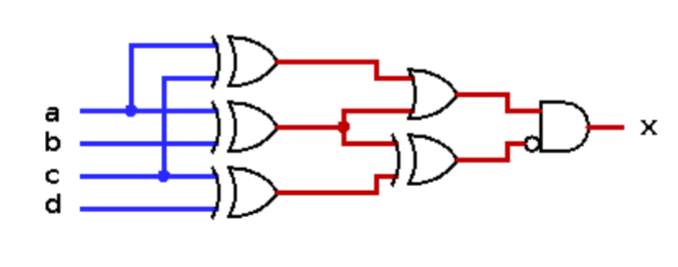
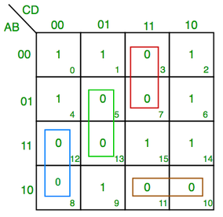
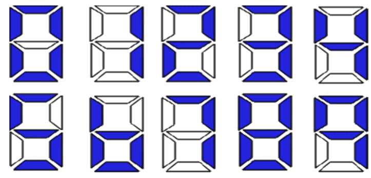

# Module 1: Propositional Logic and Basic Logic Circuits

## Goals

1. Translate back and forth between simple natural language statements and propositional logic.
2. Evaluate the truth of propositional logic statements using truth tables.
3. Translate back and forth between propositional logic statements and circuits that assess the truth of those statements.
4. Run an algorithm to systematically translate from a circuit to a propositional logic statement.
   
5. Build computational systems to solve real problems, using both propositional logic expressions and equivalent digital logic circuits.
6. Identify patterns in Truth Table in order to translate them into a propositional logic expression. 

## Definitions
**Argument**: a sequence of statements aimed at demonstrating the truth of an assertion.

**Conclusion**: assertion at the end of the sequence.

**Premises**: preceding statements in argument.

A **statement** (or **proposition**) is a sentence that is true or false but not both.

Two digital logic circuits are **equivalent** if, and only if, their input/output tables 
are **identical**.

A **recognizer** is a circuit that outputs a 1 for **exactly one** particular combination of 
input signals and outputs 0’s for **all other** combinations.

## Logical Equivalence
- denote with $p \equiv q$ 
- logically equivalent if truth tables match.
- if they have equivalent form symbolically 

## Tautologies and Contradictions
- **Tautology**: a statement that is always **true**
- **Contradiction**: a statement that is always **false**

## Simplifying Statement Forms
-  See **[Evaluation Rules](evaluation_rules.md)** for a full list

> **Example**: 

## Truth tables 

| p     | q     | r     | $(p \land q )$ | $\lnot r$ | $(p \land q )\lor \lnot r$ |
| ----- | ----- | ----- | -------------- | --------- | -------------------------- |
| **F** | **F** | **F** | F              | T         | T                          |
| **F** | **F** | T     | F              | F         | F                          |
| **F** | T     | F     | F              | T         | T                          |
| **F** | T     | T     | F              | F         | F                          |
| T     | F     | F     | F              | T         | T                          |
| T     | F     | T     | F              | F         | F                          |
| T     | T     | F     | T              | T         | T                          |
| T     | T     | T     | T              | F         | T                          |

First column should have $2^{n-1}$ **F**s and $2^{n-1}$ **T**s, for a total of $2^{n}$ combinations. Each column is then reduced by half with alternating sets of T and F until they alternate by 1.

## Digital Logic Circuits
> On $\rightarrow$ 1 or True,  Off $\rightarrow$ 0 or False 
> 
> ### Circuit Rules
> - Never combine two input wires
> - A single input wire can be split partway and used as input for two separate gates
> - An output wire can be used as input
> - No output gate can feed back into that gate (no recursion !!)
>  - Gates can have multiple inputs

## Finding a Boolean Expression for A circuit
Start from the last logic gate and slowly build downwards; or start from the leaf nodes and build upwards.
> **Example**: \
>  </img>
> $$\begin{align*}
    x &\equiv (...) \land \lnot ( ...) \\ 
      &\equiv  ((...) \lor (...)) \land \lnot (...) \\
      & \equiv ((a \oplus c) \lor (a \oplus b)) \land \lnot ((a\oplus b) \oplus (c\oplus d))
\end{align*} $$
> 
## Finding a Circuit That Corresponds to a Given Input/Output Table
1. Identify all rows that out put 1 (true)
2. Construct an AND expression that links the inputs to produce true
   - In input row: P if P is true, $\lnot P$ if P is false
3. Connect the expression for each of the rows with OR
   - simplify if possible

4. Try to generalize and find patterns in rows !! (think real hard you know)
   - group rows with similar characteristics !! 💥

> **Example**: Construct the boolean expresison for
> 
> | P   | Q   | R   | S   |
> | --- | --- | --- | --- |
> | 1   | 1   | 1   | 1   |
> | 1   | 1   | 0   | 0   |
> | 1   | 0   | 1   | 1   |
> | 1   | 0   | 0   | 1   |
> | 0   | 1   | 1   | 0   |
> | 0   | 1   | 0   | 0   |
> | 0   | 0   | 1   | 0   |
> | 0   | 0   | 0   | 0   |
>
> row 1: $P \land Q \land R$; Row 3: $P \land \lnot Q \land R$; Row 4: $P \land \lnot Q \land \lnot R$
> 
> $\therefore S \equiv (P \land Q \land R) \lor (P \land \lnot Q \land R) \lor (P \land \lnot Q \land \lnot R)$

## Simplifying Combinational Circuits
1. write cicuit in logic form
2. simplify the statement with the **[Evaluation Rules](evaluation_rules.md)**

## Finding Statement From Truth Table with Karnaugh Map (K-map)
1. split the inputs into groups
   - 4 inputs $\rightarrow$ 2 sets of 2 (AB, CD)
   - 3 inputs $\rightarrow$ 1 set of 2, 1 single (AB, C)
2. Make rows each set, and write out all the combinations ($AB$, $\lnot AB$, $A\lnot B$, $\lnot A \lnot B$ with $C$ and $\lnot C$)
3. Simplify with AND between each grouping
   - groupings can only be VERTICAL and HORIZONTAL
   - $P$ and $\lnot P$ cancel out
4. Combine each grouping with OR

> Example: Karnaugh Map\
> </img>\
> The green group: ~C and D and C and D and ~A and B and A and B $\rightarrow$ ~C and D and B\
> Do the rest for the other groups and we get: \
> $(C\land \lnot D\land \lnot B) \lor (\lnot C\land \lnot D\land A) \lor (\lnot A\land C\land D)\lor(\lnot A\land B\land \lnot C)$

## 7-segment Displays
</img>
- we will need 4 binary inputs for a total of $2^4 = 16$ possible outputs. Each corresponding binary input set will correspond to a configuration in the display.
- Imagine that each input corresponds to the behaviour of a particular segment
- the following example is taken from **worksheet 1 in module 1**.
  
If we examine the bottom left segment, we arrive at the following truth table
>|$x_3$|$x_2$|$x_1$|$x_0$|LED|
>|-|-|-|-|-|
>|0|0|0|0|1|
>|0|0|0|1|0|
>|0|0|1|0|1|
>|0|0|1|1|0|
>|0|1|0|0|0|
>|0|1|0|1|0|
>|0|1|1|0|1|
>|0|1|1|1|0|
>|1|0|0|0|1|
>|1|0|0|1|0|

- from looking real hard, we can simplfy the expression to
$$\lnot x_0 \land \lnot ( \lnot x_3 \land x_2 \land \lnot x_1 \land \lnot x_0)$$
- we realize that 4 is the only exception to the rules $\lnot x_0$, hence it must be $\lnot x_0$ AND not the row for 4.
- if we simplify further,
$$\begin{align*}
   \lnot x_0 \land \lnot ( \lnot x_3 \land x_2 \land \lnot x_1 \land \lnot x_0) &\equiv \lnot x_0 \land  (  x_3 \lor \lnot x_2 \lor x_1 \lor  x_0)\\
   &\equiv \lnot x_0 \land  ( x_3 \lor \lnot x_2 \lor x_1)
\end{align*}$$
-  we used De Morgan's law to remove the invertor. We then use the distributive term to remove $x_0$. Alternatively, we can also think of it as "**all even numbers except 4 and 5**"
- These two are not logically equivalent because the truth tables are different. However, this doesnt matter as it gets cut off because only 10 digits are required. 

- question 7: top-right segment, is only off for 5 and 6 ($0101, 0110$)
  $$\begin{align*}
   \lnot ((\lnot x_3 \land x_2 \land \lnot x_1 \land x_0 ) \lor (\lnot x_3 \land x_2 \land x_1 \land \lnot x_0)\\
   \equiv \lnot ((\lnot x_3 \land x_2) \land (x_1 \oplus x_0))
  \end{align*}$$

