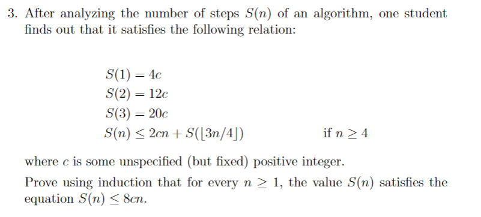

# Strong Induction Proofs

## Goals

## Strong Induction
Strong induction is similar to weak induction in that they both have an inductive step. However, strong induction assumes that all values from 0 to $k$ are true, opposed to just $P(k)$ being true. 

Use strong induction if we might need to go **multiple** inductive steps backwards. For higher degree recursion problems. It has looser constraints on the inductive step compared to weak induction.

**IMPORTANT:** just assume up to $n$, not $n + 1$. This is probably easier
- bases cases need to be continuous, or else they arent showing anything
- bases cases need to cover everything between the recursive jump ($4$ bases cases for $n-4$)

### Principle of Strong Mathematical Induction
Let $P(n)$ be a property that is defined for integers $n$, and let $a$ and $b$ be fixed integers with $a \le b$. Suppose the following two statements are true
1. $P(a), P(a + 1), ... , P(b)$ are all true (basis step)
2. For every integer $k \ge b$, if $P(i)$ is true for each integer $i$ from $a$ through $k$, then $P(k+1)$ is true (inductive step)
Then the statement
$$\forall n \ge a, P(n)$$
is true. (The supposition that $P(i)$ is true for each integer $i$ from a through $k$ is called the inductive hypothesis. Another way to state the inductive hypothesis is to say that $P(a), P(a+1), ... , P(k)$ are all true.)

## Writing Strong Induction Proofs
1. Show that $P(0)$ and $P(1)$ is true
2. State the statement that is to be proved as $P(k)$
3. Show that for every integer $k \ge 1$, if $P(i)$ is true for each integer $i$ from 0 through $k$, then $P(k+1)$ is also true (inductive hypothesis)
4. Prove that $P(k+1)$ is true using the the fact that $P(0)$ to $P(k)$ is assumed to be true.
   - "Since we have proved the basis step and the inductive step of the strong mathematical induction, we conclude that the given statement is true"

5. Conclude that the statement is true.

## Use cases and Hints
Generally used for proving recurrence relations -- especially ones that are of higher order.

Some sequences may be easier with strong mathematical induction -- the use of previous terms may be easier to compute mathematically 

The amount of base cases are usually indicative of how the inductive step should be applied
  - $k$ base cases usually mean the inductive step will be $n-k$
  - similar, and argument that jumps from $n$ to $n + k$ will require $n$ base cases.
  - use the # of base cases as a hint!

To determine how many base cases are required, start from the lower bound and go up.
   - once the pattern can repeat fully, the amount of base cases are good!
   - only need as many base cases to sustain recursion

## Theorems (that are actually examples but im too lazy to write them down)

### Existence and Uniqueness of Binary Integer Representations

### Well Ordering Principle for Integers
Let $S$ be a set of integers containing one or more integers all of which are greater
than some fixed integer. Then $S$ has a least element.

### Quotient Remainder Theorem
Given any integer $n$ and any positive integer $d$, there exist integers $q$ and $r$ such that
$$n = dq + r \;\;\text{ and }\;\; 0 \le r < d$$

## Examples
> Consider the relation:
> $$t_1 = 1$$
> $$t_n = t_{floor (n/2)} + t_{ceil(n/2)} + 1, n \ge 1$$
> prove that $t_n = 2n - 1$

Because this relationship may be moving more than one step back, we need to use strong induction. 

**Base Case**: $n = 1$ \
$t_1 = 1 = 2 * 1 - 1$

**Induction Hypothesis**: assume that $t_k = 2k - 1$, for any positive integer $1 \le k < n$. (from smallest base case to just before n)

**Inductive step**: consider an unspecified positive integer $n > 1$. By IH, we know that
- $t_{floor (n/2)} = 2floor(n/2) - 1$
- $t_{ceil (n/2)} = 2ceil(n/2) - 1$
then we know
$$t_n = t_{floor (n/2)} + t_{ceil(n/2)} + 1$$
$$t_n = 2floor(n/2) - 1 + 2ceil(n/2) - 1 + 1$$
$$t_n = 2floor(n/2) + 2ceil(n/2) - 1$$
$$t_n = 2(floor(n/2) + ceil(n/2)) - 1$$
$$t_n = 2n - 1$$

## Practice !!
5. Suppose that $e_0, e_1, e_2, ...$ is a sequence defined as follows: 
   $$e_0 = 12, e_1 = 29,$$
   $$e_k = 5e_{k-1} - 6e_{k-2}, \forall
    k \in \mathbb{Z}, k \ge 2$$
    Prove that $e_n = 5 \cdot 3^n + 7 \cdot 2^n, \forall n \ge 0$
> Solution \
> The proposition, $P(n)$ that we are trying to prove is as follows
> $$e_n = 5 \cdot 3^n + 7 \cdot 2^n, \forall n \ge 0.$$
> $P(0)$ is true because $12 = 5 \cdot 3^0 + 7 \cdot 2^0$. Similarly,
> $P(1)$ is also true because $29 = 5 \cdot 3^1 + 7 \cdot 2^1.$ 
> 
> Suppose $P(n)$ is true for $1 \le n \le k$, we then try to show that $P(k+1)$ is also true. 
> $$5e_{k} - 6e_{k-1} =  5 \cdot 3^{k+1} + 7 \cdot 2^{k+1}$$
> since we know $P(k)$ and $P(k-1)$

> 
> Base cases:
> 
> $S(1) = 4c < 8c$ \
> $S(2) = 12c < 16c$ \
> $S(3) = 20c < 24c$ \
> Inductive hypothesis: assume true for $3 \le k < n$.
>
> Inductive step: we try to prove for $n$. We know that
> $$S(n) \le 2cn + S(\lfloor 3n/4 \rfloor)$$
> Moreover, by the inductive hypothesis, we know that
> $$S(\lfloor 3n/4 \rfloor) \le 8c*\lfloor 3n/4 \rfloor \le 8c * 3n/4$$
> So we get
> $$S(n) \le 2cn + 8c*\lfloor 3n/4 \rfloor$$
> $$S(n) \le 2c(n + 4*3n/4)$$
> $$S(n) \le 8cn$$