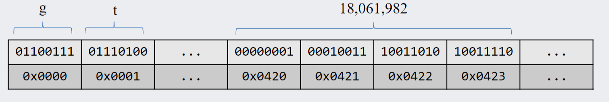

# A Working Computer

## Goals
- [x] Evaluate if a function f is in **big**-O of a function g.
- [x] Evaluate if a function f is in big-**Omega** of a function g.
- [x] Evaluate if a function f is in big-**Theta** of a function g.

- [x] Use Direct Proofs to show that a function f is in **big-O** of a function g.
- [x] Comprehend how big-O is used to analyze an algorithm efficiency.
- [x] Specify the overall architecture of a (**Von Neumann**) stored program computer — an architecture that instantiates the principle that both program and data are bits (i.e., state) loaded and stored in (common) memory.
- [x] Trace execution of an instruction through a working computer: the basic fetch-decode-execute instruction cycle and the data flow to/from the arithmetic logic unit (ALU), the main memory and the Program Counter (PC).


## Big-O, Big-Omega, and Big-Theta Notations
a key part in understanding algorithm efficiency 
- how many computations are required as the input increases in size?

> Definition: Suppose $f$ and $g$ are real-valued functions of an integer variable $n$ and suppose $g(n) \ge 0$ for every integer $n$ greater than some positive real number
> 1. If for sufficiently large values of $n$, $A \cdot g < f$, then $f$ is order *at least* $g$, written as $f(n)$ is $\Omega(g(n))$
> 2. If for sufficiently large values of $n$, $0 < f < B \cdot g$, then $f$ is order *at most* $g$, written as $f(n)$ is $O(g(n))$
> $$f(n) \in O(g(n))$$
> $$\boxed{\exists c \in \mathbb{R}^+, \exists n_0 \in \mathbb{N}, \forall n \in \mathbb{N}, n \ge n_0 \implies f(n) \le c \cdot g(n)}$$
> 3. If for sufficiently large values of $n$, $A \dot g < f < B \cdot g$, then $f$ is of order $g$, written as $f(n)$ is $\Theta(g(n))$
> 
> 

These three functions are all related
> Theorem: Relation between $\Omega, O, \Theta$
> 
> If $f$ and $g$ are real valued functions defined on the same set of nonnegative integers, and if $f(n) \ge 0$ and $g(n) \ge 0$ for every integer $n \ge r$, where $r$ is a positive real number,
> 
> then $f(n)$ is $\Theta(g(n))$ $\iff$  $f(n)$ is $\Omega(g(n))$ and $f(n)$ is $O(g(n))$

## Orders of Polynomial functions

> Theorem:
>
> if $r \le s$ then $n^r \le n^s$

### Big O and Omega of polynomials
consider $g = 15n^3 + 11n^2 + 9$

to find the big omega of the function, we need to find a find a polynomial less than $g$. Trivially, 
$$An^3 \le 15n^3 + 11n^2 + 9$$
Similarly, to find the big O of $g$, we need to find a function that is larger than $g$. Suppose we make every term have the same highest order:
$$15n^3 + 11n^2 + 9 \le 15n^3 + 11n^3 + 9n^3 \le 35n^3$$
Hence, we know $g$ is $O(n^3)$, $\Omega(n^3)$, and $\Theta(n^3)$. 

For polynomials with negatives, this process becomes more difficult. Suppose we have a polynomial $g = n^4 - 5n - 8$. To solve this, we need to use the fact that $0.5n^4 - n^4 = -0.5n^4$. Suppose we have 
$$\frac{1}{2}n^4 \ge 5n^3 + 8n^3$$
By transitivity, we can extend this to
$$\frac{1}{2}n^4 \ge 5n^3 + 8n^3 \ge 5n + 8$$
$$\frac{1}{2}n^4 \ge 5n + 8$$
We then need to find some value $a$ that satisfies this inequalities 
$$\frac{1}{2}n^4 \ge n^3(5 + 8) \implies \frac{1}{2}n \ge (5 + 8)  \implies n \ge 26$$
So we find that $a = 26$. Next, we can rewrite our inequality in a more familiar form by subtracting both sides with $n^4$:
$$\frac{1}{2}n^4 \ge 5n + 8 \implies -\frac{1}{2}n^4 \ge 5n + 8 - n^4$$
We can then flip the inequality:
$$\frac{1}{2}n^4 \le    n^4 - 5n - 8$$
hence, we have found  $\Omega(n^4)$ for the function $g$. To find $O$, a same process as that of the positive can be applied.

> Summary:
>
> To prove $\Omega(f(n))$ of some function $g(n)$ with $a_m$ on the most significant term
>
> 1. $A = \frac{1}{2}a_m$
> 2. $a = \frac{2}{a_m}(|a_1| + ... + |a_n|)$ or 1 (which ever is larger) except for $a_m$
> 3. prove by using the fact that $\frac{1}{2}a_mn^m - an^m = -\frac{1}{2}a_nn^m$

### Transitivity in big O
> For any function $f$ and positive real numbers $r$ and $s$ with $r <  s$,
> 
> $f(n)$ is $O(n^r)$ $\implies$ $f(n)$ is $O(n^s)$

### Warning about big O
is is only true for sufficiently large values of $n$, at smaller values things can be different. For example linear is better than log at smaller scales

### Finding big O
we can just consider the dominating term and ignore the rest of the terms. Since the largest growing term will dominate

## Formal Proofs
Directly (or indirectly) prove that the formal definition for big O. 
- let some $c$
- let some $n_0$
- consider an unspecified natural number $n$
- assume that $n \ge n_0$
- show $f(n) \le c \cdot g(n)$
  
The key is to use the transistive property of inequalities, you can **only** increase the bounds of the inequality **never** restrict it.

$c$ and $n_0$ can be filled out AFTER.

## Hints for Big O proofs
- $n - 1$ works for $n \ge 1$
- it is reasonable to introduce $kn^2 - cn$ for adequately large values of $n$ (literally pull it out of nowhere)
  - you can introduce new negative values as long you do it properly.
- $n/k$ works for $n \ge k$

# A working computer
-  a processing unit contains an arithmetic and logic unit, and processor registers
-  a control unit containing an instruction register and a program
-  memory storing data and program instructions
-  external mass storage
-  input and output mechanisms

## Memory
Think of it as one big array of bytes (1 byte per location, 8 bits)
- each value has a corresponding address pair
- longer instructions are chopped into 8 bytes and stored consecutively
  - ints, floats, long, ascii, and unicode
- only one byte can be transferred per clock cycle to the CPU
  
## Arithmetic and logic units
- combinational component which performs arithmetic and logical operations
  - +, -, *, /, AND, OR, etc
- it can detect overflow and other status
- the function is chosen by multiplexers, select bits will be given by the control unit (as opcode)

## Control unit
- a sequential device that controls the process of:
  - reading instructions and data from memory
  - deciding which instructions to execute
  - executing the instructions sequentially
    - not exactly true but what it looks like

- contains the program counter (PC), a register that contains the memory address of the next instruction

## Our computer
Implements the fictional Y86 architecture presented in the textbook by Bryant and O'Hallaron, used in CPSC 313.
A small subset of the IA32 architecture

The Y86 cpu has:
- 12 types of instructions
- one program counter (PC) register
  - contains the address fo the next instruction to execute

- 8 general-purpose 32-bit registers
  - used for temporary values we are currently working on
- one 48 bit instruction register (IR)
  - holds pieces of an instruction while it gets retireved from meory

- Condition code register (CCR)
  - holds condition flags for the results of arithmetic operations

Instructions:

- instruction length ranges from 1-6 bytes, it really depends!
- exmaple: `irmovl 0xCAFEF00D, %ecx`
- 
- for every 4 bits: immediate move, function, source register, destination register, valc

### More instructions:
- `irmovl 0x1A, %ecx`
  - this instruction stores a constant value in a register (think assigning value to var)
  - in this case it stores the hex value $1A$ is stored in `%ecx`
  - "immediate-register move `0x1A` to `%ecx`
  - this new values is "immediately" availabel as part of the binary instruction, and does not need to be retried from memory or a register

- `subl %eax %eab`
  - this subtracts the value stored in one register to the next
  - they are the source, and destination registers respectively
  - This instruction takes the value contained in `%eax`, subtracts it from the value contained in `%ebx`, and stores the result back in `%ebx`.

### Sample program
```assembly
label: irmovl 0x35, %eax
irmovl 0x3, %ebx
subl %eax, %ebx
jge label
halt
```
This program:
- moves `0x35` (53) into register A
- moves `0x3` (3) into register B
- subtracts A's contents from B's contents and stores the result in B
- checks if the last computed result is greater or equal to 0
 - goes to label if test is true
- Test is false, so execute next instruction (halt, program ends)
  - A: 0x00000035 (53)
  - B: 0x00000003 (3)B: 0xFFFFFFCE (−50)

### knowing stuff
- how does the computer know which instruction does what?
  - each instruction is a sequence of 8 to 48 bits
  - the first 8 bits (icode/fcode) determine the instruction type
    - Control unit uses these bits to decide how many more bits need to be retrieved from memory to assemble the complete instruction
    -  Also will allow the control unit to send the appropriate select signals to the various multiplexers in the CPU

### Executing instructions
The Y86 CPU divides the excecution into 6 stages:
- Fetch: read instructions from memory and determine new PC value
- Decode: read values from registers or other sources
- Execute: use the ALU to perform computations
- Memory: read data from or write data to memory
- Write-back: store value(s) into register(s). Occurs when a register is the destination
- PC update: store the new PC value

Some instructions may skip some stages. It needs TWO clocks --> read data and perform operations, write and update data.

#### Examples:
`irmovl 0xABADD00D, %ecx`
1. Fetch:
current instruction ← 30F1ABADD00D
next PC value ← current PC value + 6
1. Decode: valC ← ABADD00D
2. Execute: valE ← valC
3. Memory: (no memory access for this instruction)
4. Write-back: %ecx ← valE
5. PC update: PC ← next PC value 

<br>


`subl %eax, %ebx`
1. Fetch:
current instruction ← 6103
next PC value ← current PC value + 2
1. Decode:
(valA ← %eax) and 
(valB ← %ebx)
1. Execute: valE ← valB − valA
2. Memory: (no memory access for this instruction)
3. Write-back: %ebx ← valE
4. PC update: PC ← next PC value

<br>

`jge label`
1. Fetch:
current instruction ← 7500BABACA (memory address where the label operation resides)\
next PC value ← current PC value + 5
2. Decode: valC ← 00BABACA
3. Execute: brc ← 1 or 0 (depending on ValE, if the conditions are met)
4. Memory: (no memory access for this instruction)
5. Write-back: (no general purpose register access)
6. PC update:\
if brc is 0, PC ← next PC value\
if brc is 1, PC ← valC 

<br>

`rmmovl rA, D(rB)`
- "register to memory move" -- copies the contents of rA into memory at the adress D spaces away from the address contained in rB
1. Fetch: gets the instruction (XXYY) and calculates next pc value
2. Decode: gets the data from register A and B (YY)
3. Execute: valE <-- adds D to the value in rB
4. Memory: omg it moves and goes to the memory
5. Write-back: (none)
6. PC update: next pc value


## Working computers (i aint working)
Operations are separated into two distinct clock cycles: read and write/execute
- read: fetch, decode
- execute: executes stuff, update `PC`
- write: writes data to memory or registers
  
Overview of the computing stages
1. **Fetch stage**
   - Gets the 6 byte instruction using `PC` --> and stores in to `IR`
   - reads `iCd`, `iFn`, (first byte). 
   - computes `valP` depending on `iCd` (`PC + n`) (Preliminary `next PC`)
   - reads `rA`, `rB`, `valC`
   - `rA` are the raw register location `rB` from the **second** byte of the instruction. `valC` is the remaining information that the instruction holds
   - passes on the info the **decode** stage
2. **Decode stage**
   - computes `srcA`, `srcB` from `rA`, `rB` and `dstE` based on `iCd`.
   - `srcA`, `srcB` are **computed** register addresses from `rA` and `rB`. 
   - then uses `srcA`, `srcB` addresses to get `valA`, `valB`
   - the data are passed onto the **execute** stage
3. **Execute stage**
   - execute takes `valA`, `valB` and sends them to the **ALU**.
   - the **ALU**, depending on `Opcode` from the `iFn`, it computes `valE` by performing operations on `valA` and `valB`
   - the `bch` value is computed with the previous **CCR** value
   - **CCR** is updated depending on the flags a result of computation. 
   - **Update PC**: final `valP` or some other computed value is written to `next PC` depending on the instruction

4. **Memory**
   - given the specific instruction and the values of `valE` (the memory location). The value is written to memory (not registers).
5. **Write back** (only **one** or **neither** of Memory and write back can occur in the same instruction)
   - Register values can also be updated instead of memory
   - the values of `valE` are written to `dstE` (register location)