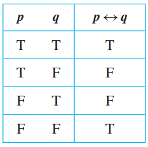

# Module 2: Propositional and Conditional Logic

## Goals
1. Translate back and forth between simple natural language statements and propositional logic, now with conditionals and biconditionals.
2. Evaluate the truth of propositional logical statements that include conditionals and biconditionals using truth tables.
3. Given a propositional logic statement and an equivalence rule, apply the rule to create an equivalent statement.
   
4. Explore alternate forms of propositional logic statements by application of equivalence rules, especially in order to simplify complex statements or massage statements into a desired form.
5. Build computational systems to solve the 7- or 4-segment LED displays, using both propositional logic expressions and equivalent digital logic circuits.

## Definitions

If p and q are **statement variables**, the conditional of q by p is “If p then q” or 
“p implies q” and is denoted $p \implies q$. It is false when **p is true and q is false**; otherwise it is true. 

In a conditional, we call **p the hypothesis (or antecedent)** of the conditional and **q the conclusion (or consequent)**.

Given statement variables p and q, the biconditional of p and q is **“p if, and only if, q”** and is denoted $p \iff q$. It is **true** if both p and q **have the same truth values** and is **false** if p and q have **opposite truth values**. The words if and only if are sometimes 
abbreviated **iff**.

## Conditional Statements
$\implies$ is just like any other connective ($\lor$, $\land$)
 - distributive laws applies to $\implies$ !!
> If 4,686 is divisible by 6, then 4,686 is divisible by 3 \
> If P, then Q \
> $P \implies Q$
>
> P is the ***Hypothesis*** and Q is the ***Conclusion***
> 
> If P is false, the conditional is by default **true** (vacuously true). If P is false, it doesnt matter whether Q is false or not, hence the statement will be **true**\
> </img>

## Representation of If-Then as Or

$$P \implies Q \equiv \lnot P \lor Q$$
> Example: Rewrite the following statement in if-then form. \
> Either you get to work on time or you are fired \
> $\rightarrow$ If you do not get to work on time, then you are fired.
>

## The Negation of a Conditional Statement
The negation of “if p then q” is logically equivalent to “p and not q.”
$$\lnot (P \implies Q) \equiv P \land \lnot Q$$
> Example: Write negations of the following statements\
> If my car is in the repair shop, then I cannot get to class\
> $\rightarrow$ My car is in the repair shop and I can get to class.

## The Contrapositive of a Conditional Statement
A conditional statement is logically equivalent to its contrapositive.
$$P \implies Q \equiv \lnot Q \implies \lnot P$$
> Example: Write the contrapositive for the following statement
> If Howard can swim across the lake, then Howard can swim to the island \
> $\rightarrow$ If Howard cannot swim to the island, then Howard cannot swim across the lake

## The Converse and Inverse of a Conditional Statement
These two variants of the conditional are **NOT** logically equivalent. \
For the conditional statement $P \implies Q$
1. **Converse**: If Q then P, $Q \implies P$
2. **Inverse**: If not P then not Q, $\lnot P \implies \lnot Q$
> Example: write the converse and inverse of the folloing statement\
> If Howard can swim across the lake, then Howard can swim to the island \
> $\rightarrow$  Converse: If Howard can swim to the island, then Howard can swim across the lake. \
> $\rightarrow$ Inverse: If Howard cannot swim across the lake, then Howard cannot swim to 
the island.

### Note that:
1. A conditional statement and its converse are not logically equivalent.
2. A conditional statement and its inverse are not logically equivalent.
3. The **converse and the inverse** of a conditional statement are **logically equivalent** 
to each other.

## Only if and the Biconditional
"P only if Q" means that P occurs only if Q occurs also. This means if Q does not occur, then P also **does not** occur.
> If P and Q are statements
> $$\text{``P only if Q" means ``If not Q then not P"}$$
> which is equivalently written as the contrapositive of
> $$\text{``If P then Q"}$$ 
>

> **Example**: convert the only if statement to if then\
> John will break the world’s record for the mile run only if he runs the mile in under four minutes \
> $\rightarrow$ If John does not run the mile in under four minutes, then he will not break the world’s record
> 
### If and Only IF

The biconditional "P if and only if Q" is denoted as 
$$P \iff Q \equiv (P \implies Q) \land (Q \implies P) \equiv (P \lor Q) \land \lnot (P \land Q)$$
In iff the conditional in **BOTH** directions are true. Check [connectives](symbols.md) for more details.

 </img>

> Example: Rewrite the following statement as a conjunction of two if-then statements: \
> This computer program is correct if, and only if, it produces correct 
answers for all possible sets of input data. \
> $\rightarrow$  If this program is correct, then it produces the correct answers for all possible 
sets of input data; and if this program produces the correct answers for all possible sets of 
input data, then it is correct.

## Necessary and Sufficient Conditions
> If r and s are statements
>  -  r is a sufficient condition for s means “if r then s.”
>  - r is a necessary condition for s means “if not r then not s.”
>    - "if s then r"
> - r is a necessary and sufficient condition means "r if and only iff s"

### Converting a Sufficient Condition to If-Then Form
> Example: Rewrite the following statement in the form “If A then B”:\
> Pia’s birth on U.S. soil is a sufficient condition 
for her to be a U.S. citizen.\
> $\rightarrow$ If Pia is born on U.S. soil, then she is a U.S. citizen.

### Converting a Necessary Condition to If-Then Form
> Example: Use the contrapositive to rewrite the following statement in two ways:\
> George’s attaining age 35 is a necessary condition for his being president of the United States. \
> $\rightarrow$ If George is the president of the United States, then he is 35 years old\
> $\rightarrow$ If George is not 35 years old, he is not the president of the United States.

## Logical Equivalence Proofs
- state the expression you want to prove
- indicate the beginning with proof
- start with one side and make it equal to the other
  - one step at a time $\rightarrow$ with justification
  - usually simplify the more complex side to math the simpler one
  - indicate the end with proof with **QED** or $\Box$

Only one rule per line! except for
- DeMorgan and Double Negative
- Associative + Commutative (grouping and rearranging)
- then same law is applied on independent sections

## SUMMARY OF SECTION
For the conditional statement $P \implies Q \equiv \lnot P \lor Q$
 - It is **false** if and only if **P is false and Q is true**
 - same as "P only if Q"
 - Equivalent with its **contrapositive** $\lnot Q \implies \lnot P$
 - **NOT** equivalent with
   - Converse: $Q \implies P$
   - Inverse: $\lnot P \implies \lnot Q$
- The Converse is equivalent to the Inverse

For the Unconditional statement $P \iff Q$
- It is false only when P and Q are different
- Equivalent with $(P \implies Q) \land \lnot (Q \implies P)$ and $P \oplus Q$

 If r and s are statements
  -  r is a sufficient condition for s means “if r then s.”
  - r is a necessary condition for s means “if not r then not s.”
    - "if s then r"
 - r is a necessary and sufficient condition means "r if and only if s"
