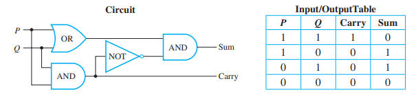
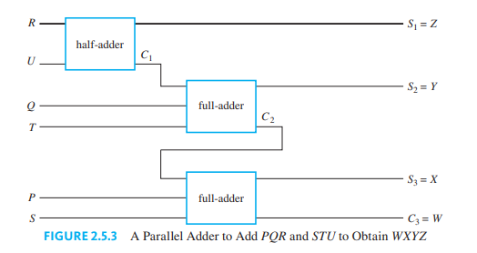
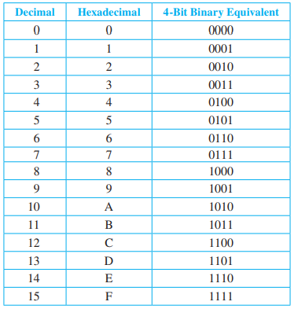

# Module 3: Number Systems and Circuits for Operations

## Goals
1. Convert unsigned (i.e., non-negative) integers from decimal to binary and back.
2. Take the two's complement of a binary integer.
3. Convert signed (i.e., positive, negative, or zero) integers to binary and back.
4. Convert unsigned (i.e., non-negative) integers from hexadecimal to binary and back.
  
5. Add two binary integers.
6. Critique the choice of a digital representation scheme—including describing its strengths, weaknesses, and flaws (such as imprecise representation or overflow)—for a given type of data and purpose, such as (1) fixed-width binary numbers using a two's complement scheme for signed integer arithmetic in computers or (2) hexadecimal for human inspection of raw binary data.

## Number of System of Base B

The decimal system is represented by the addition of the powers of 10.
$$N_{B} = d_nd_{n-1}...d_1d_0 = d_n \cdot B^n + d_{n-1} \cdot B ^{n-1} + ... + d_1 \cdot B^1 + d_0 \cdot B^0$$

It has digits from 0 to $B-1$. If B > 10, use letters. For example, base 16 uses 0, 1,2, 3, 4, 5, 6, 7, 8, 9, A, B, C, D, E, F.

## Binary System
The binary system is the addition of the powers of 2.
$$N_{2} = d_nd_{n-1}...d_1d_0 = d_n \cdot 2^n + d_{n-1} \cdot 2 ^{n-1} + ... + d_1 \cdot 2^1 + d_0 \cdot 2^0$$
The digits in binary are ONLY 0 and 1.

The binary system can be extended to fractional values. 
$$N_{2} = 0.d_nd_{n-1}...d_1d_0 = d_n \cdot \frac{1}{2}^1 + d_{n-1} \cdot \frac{1}{2}^{2} + ... + d_1 \cdot \frac{1}{2}^{n-1} + d_0 \cdot \frac{1}{2}^n$$

As a result, decimal binary numbers can only be finitely represented if the fraction can be written as a sum of $\frac{1}{2}$ powers. 

Because most fractions cannot be represented exactly with binary, there is floating point error, and fraction representations will always be inexact.

## Converting a Binary to a Decimal Number
Add the powers of 2 together. A binary number with $n$ digits can represent decimal values from the range $[0, 2^{n-1}]$.
> Example: find the base 10 representation of $110101_2$\
> $1* 2^5 + 1*2^4 + 0 *2^3 + 1*2^2 + 0 * 2^1 + 1 * 2^0 = 53$
> 
## Converting a Decimal to a Binary Number
1. Repeatedly divide the number by 2 and record the remainder at each step.
2. reverse the order of the remainders

> Example: find the binary representation of 25\
> $25 / 2 = 12 R 1$ \
> $12 / 2 = 6 R 0$\
> $6 / 2 = 3 R 0$\
> $3/2 = 1 R 1$\
> $1/2 = 0 R 1$\
> $25_{10} = 11001_2$
## Binary Addition and Subtraction
Exactly same as addition in base 10, just do the carries and stuff. NOTE: 1 is the max and anymore will overflow.
> Example: add 1101 and 111
> $$\begin{align*} .^1 1^11^10^11& \\+\;\;\; 1\;1\;1& \\ 1\;0\;1\;0\;0& \end{align*}$$

The same is true for subtraction. Remember to do the borrows $10 - 1 = 1$.
>   Example: subtract 11000 and 1011
> $$\begin{align*} 0\;1\;1\;\;\;\;\\1\;1^10^10^10& \\ - \;\;1\;0\;\;1\;1& \\ 1\;1\;\;0\;1\end{align*}$$

## Circuits for Binary Addition
- $1 + 1 = 10$
- $1 + 0 = 01$
- $0 + 1 = 01$
- $0 + 0 = 00$

The circuit that adds 2 ONE digit binary numbers is called a **half-adder**. The **carry** is an **AND** gate and the **sum** is an **XOR** gate.

</img>

To construct a proper addition circuit, you need to create a **+full adder** to add 3 digits (carry).
$$\begin{align*}
    P\\Q\\+R\\ \hline CS
\end{align*}$$
We can break it down into two **half adders**

1.  $$\begin{align*}
    P\\+Q\\\hline C_1S_1 \end{align*} \implies \begin{align*}
    C_1S_1\\+\;R\\\hline \;\; \end{align*} \implies \begin{align*}
    S_1\\+\;R\\\hline C_2S \end{align*} $$
2. It is impossible for $C_1$ and $C_2$ to both be 1, because $1+1 = 10$, which gives a max carry of 1. Hence we can say $C \equiv C_1 \lor C_2$
3. Combining each half-adding step, we get 

</img>

To add TWO numbers with MORE digits, we cain chain full adders in parallel (**Parallel Adder**) \

</img>

## Signed Integers
 Computers use a fixed amount of bits to represent binary integers. The sign can be represented by the **left most bit**. If the left most bit is active subtract $2^{n-1}$ from the digit. An $n$ bit signed integer can represent values from $[-2^{n-1}, 2^{n-1} -1]$. Note that the range of values that a signed integter can represent is same as that of an unsigned integter.
 > Example: \
 > 127  = 01111111 \
 > -128 = 10000000\
 > The left most bit denotes **-128**, and the rest are added. ie\
 > -100 = 10011100 = -128 + 4 + 8 + 16

 There are many ways to represent signed integers, but in this course, we use the **twos-complement**!!

## Two's Complements and the Computer Representation of Signed Integers

 However, subtraction with signed integers is complicated so we can use the two's complement instead.
 > 8 Bit Two's Complement: for an integer $a$ between -128 and 127
 > $$\text{Two's complement of }a = \begin{cases}
      a & a\geq 0 \\
      2^8 - |a| & 0 < 0
 \end{cases}.$$
### Computing the Two's Complement (8-bit)
- write the 8-bit binary representation of $|a|$
- Switch all the 1’s to 0’s and all the 0’s to 1’s. (This is called flipping, or complementing, the bits.
  
- Add 1 in binary notation.

> Example: compute the two's complement for -46\
> $|-46|_{10} = 46_{10} = 00101110_2 \rightarrow 11010001 \rightarrow 11010010$

### Rationale 
1. The binary representation of $2^8 - 1 = 11111111_2$
2. Subtracting an 8-bit binary number from $11111111_2$ switches all the 1s to 0s and vice versa.
3. $2^8 - |a| = [(2^8 - 1)-|a|] + 1$ for any number

### Finding a Number with a Given Two’s Complement
Do the same thing as finding the two's complement
> Example: find the decimal representation with the two's complement 10101001\
> $10101001 \rightarrow 01010110 \rightarrow01010111 \rightarrow 87 \rightarrow -87$

## Addition and Subtraction with Integers in Two’s Complement Form
$$A - B = A + (-B)$$
We can just add numbers to subtract if the negative numbers are written in its two's complement form (**9th bit is discarded**).
### Rationale:
$$(A + B_t) = A + 2^8 - |B| = A - B + 2^8$$
$$(A - B + 2^8) \pmod{2^8} \equiv (A - B)\pmod{2^8} + 0$$
Since $A - B < 2^8$
$$\boxed{ A - B \equiv (A + B_t)\pmod{2^8}}$$

## Representing Fractional Values with Decimals
!!! i need to do this shit !!

## Hexadecimal Notation
Known as Base 16, and is based on power of 16.
$$N_{16} = d_nd_{n-1}...d_1d_0 = d_n \cdot 16^n + d_{n-1} \cdot 16 ^{n-1} + ... + n_1 \cdot 16^1 + n_0 \cdot 16^0$$

</img>

## Converting Hexadecimal to Decimal
Apply same method as [Converting a Decimal to a Binary Number](#converting-a-decimal-to-a-binary-number). Use the base and multiply.

> **Example**: Convert $3CF_{16}$ to decimal notation\
> $3*16^2 + 12*16^1 + 15*16^0 = 975_{10}$

## Converting Decimal to Hexadecimal
Apply same method as [Converting a Decimal to a Binary Number](#converting-a-decimal-to-a-binary-number), except divide by 16.

> **Example**: Convert 1628 to hexadecimal notation\
> $1628/16 = 101 R 12$\
> $101/16 = 6 R 5$\
> $6/16 = 0 R 6$\
> $1628_{10} = 65C_{16}$

## Converting Hexadecimal to Binary
Base 16 happens to be a power of 2. If we look at the expansion of Hexadecimal, 
$$\begin{align*}
    N_{16} &= d_n \cdot 16^n + d_{n-1} \cdot 16 ^{n-1} + ... + n_1 \cdot 16^1 + n_0 \cdot 16^0 \\ &= d_n \cdot 2^{4n} + d_{n-1} \cdot 2^{4(n-1)} + ... + n_1 \cdot 2^4 + n_0 \cdot 2^0
\end{align*}$$
We realize we can directly convert each digit in a hexadecimal to its **4 digit** binary counterpart and **append it** together for the binary definition.

> **Example**: find the binary representation of $C50A_{16}$\
> $1100 \; 0101 \; 0000 \; 1010  \rightarrow 1100010100001010$

## Converting Binary to Hexadecimal
Using the logic derived above
 1. Group the digits of the binary number into sets of four, starting from the right and adding leading zeros as needed.
2. Convert the binary numbers in each set of four into hexadecimal digits. Append those hexadecimal digits.

> Example: Convert $100110110101001_2$ into hexadecimal notation\
> $0100 \; 1101 \; 1010 \; 1001 \rightarrow 4DA9_{16}$

## Overflow and Underflow
**Overflow**: when you run out of space,greater than upper bound
- addition of two positive operands produces a negative sum
- $\lnot a_{n-1} \land \lnot b_{n-1} \land s_{n-1}$

**Underflow**: when you run out of space, less that lower bound
- addition of two negative operands produces a positive sum
- $a_{n-1} \land b_{n-1} \land \lnot s_{n-1}$

For unsigned, the number of bits increase during overflow.
- check the overflow a $n$ bit number becomes $n+1$ bits.

## Reading Memory Dumps
On a computer, smallest memory is 1 byte (8 bits). Memory dumps are just **dumps of the bytes**. They are shown in Hexadecimal (2 digits). The actual content can be found by converting to binary.
> **Example**: What does memory dump of A3 BB 59 2E represent?\
> $A3_{16} = 10100011_2 \;$ $BB_{16} = 10111011_2 \;$ $59_{16} = 01011001_2 \;$ $2E_{16} = 00101110_2$
>

## Modular Arithmetic

Mathematics with remainders
- classifying operations, calculations, and grouping numbers based on remainders

$$x \equiv y \mod{m}$$
if $x/m$ and $y/m$ have the same remainder
- not that modulo returns a whole *class* of numbers, all with the same remainder (think loops around a clock, its periodic!)
- with modular arithmetic, order of operations and modulus does not matter
- you can do the operations before doing the mods.

### Fundamental theorem of arithmetic
if $a \equiv c \mod{m}$ and $b \equiv d \mod{m}$, then
$$ax + b = cx + d \mod{m}$$

When integers overflow in a computer, we are essentially performing modular arithmetic. 

## Character encoding
- computers encode text characters in a system of bits 

- ASCII uses 7 bits to represent 128 different characters
  - each 7 bit combination of binary represents a different character (look it up on a table)
  - (0-9, A-Z, a-z) are the ordered encoding (the bits go up as u go down the list!)
  - number = 011 [. . . .], upper case 10 [. . . . .], lower case 11 [. . . . .]

## Real numbers

- floats are represented into a pseudo scientific form
- there is a mantissa and exponent part
- $1724 = 0.1724 \times 10^4$
- $1.1011011101010 \times 2^{1010}$
- mantissa -> 23 bits for float, 52 bit for double
- the exponents has 8 bits in float and 11 bits in double
- 1 bit to represent the sign
- for floats, a total of 32 bits
- sign ... exponent ... mantissa 

## Worksheet 3

Consider an n-bit binary number
1. We can represent $2^{n}$
2. the range for an unsigned integer is $[0, 2^{n}-1]$
3. the range for a signed integer is $[-2^{n-1},2^{n-1}-1]$
4. Because in a representation of a signed binary integer, the first digit represents $-2^{n-1}$, and the rest of the digits add on to that value, so theres always one less positive integer. Basically you need to start from negative. Or in other words, one bit is reserved for the negative contribution (left-most), so there is only $n-1$ bits available to create the positive number.
5. if the left most bit is 1, its negative. if its 0, is positive. If everything is 0, the number is 0.
6. the most negative number, the negation is not possible. Inversion with two's complement will also not work.
