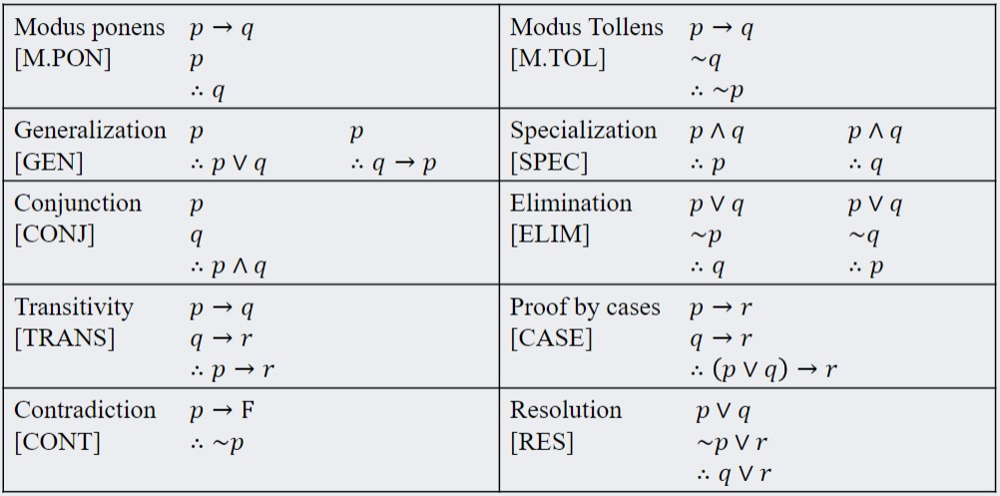
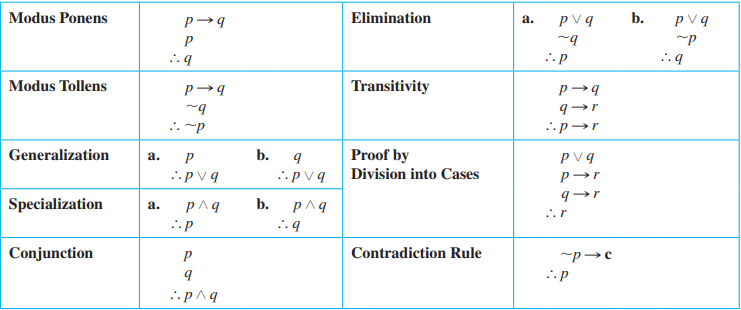

# Module 04: Propositional Logic Proofs

## Goals
1. Use **truth tables** to establish or refute the **validity of a rule of inference**.
2. Given a rule of inference and propositional logic statements that correspond to the rule's premises, apply the rule to **infer a new statement** implied by the original statements.

3. Determine whether or not a propositional **logic proof is valid**, and explain why it is **valid or invalid**.
4. Explore the consequences of a set of propositional logic statements by application of **equivalence and inference rules**, especially in order to massage statements into a desired form.
5. Devise and attempt multiple different, appropriate strategies for **proving a propositional logic statement** follows from a list of premises.

## Definitions

**Argument**: a sequence of statements 

**Argument form**:  a sequence of statement forms. 

**Premises (or assumptions or 
hypotheses)**: All statements in an argument and all statement forms in an argument form, except for the final one. 

**Conclusion**: final statement form in an argument. the symbol $\therefore$ is typically placed before the conclusion.

**Argument Form is Valid**: no matter what statement is substituted into the argument, if the resulting premises are all true, then the conclusion is also true. If the premises are impossible (always false), the argument is valid by default.

**Argument is Valid**: its form is valid.

**Argument is Sound**: its form is valid and its premises are true (true content-wise). See [Soundness](#soundness)

**Critical row**: row in truth table where all of the premises are true.

**Syllogism**: an argument form consisting of 2 premises and a conclusion. [See this section for more details](#modulus-ponens-and-modulus-tollens)
- **Major premise**: first premise
- **Minor premise**: second premise

**Supposition**: initial guess or hypothesis. (Suppose ...)

## Form of Argument
An argument can be written as

$$\begin{align*}
    \text{Premise 1}\\
    \text{Premise 2} \\
    \vdots \\
    \text{Premise n}\\
    \hline
    \therefore \text{Conclusion}
\end{align*}$$
 Proving such an argument shows that if all the premises are true, the conclusion must also be true. Symbolically, we can write
 $$\boxed{(\text{Premise 1} \land \text{Premise 2} \land \dots \land \text{Premise n}) \implies \text{Conclusion}}$$

## Valid and Invalid Arguments
We only discuss the validity of argument **form**, not of the contents itself. If the **premises are true**, the **conclusion** that follows **must be true**.

### **Test for Validity**
1. Identify the premises and conclusion of the argument form
2. Construct **truth table** of the premises and arguments
   
3. If **every** critical row is true (premises **and** conclusion are **true**), the argument form is **valid**
4. if the premises are **always false**, the statement overall is valid.

> **Example**: Determine the validity of the following statement
> $$\begin{align*}
    p &\implies q \lor \lnot r \\
    p &\implies  p \land r \\
    \therefore p &\implies r \\
\end{align*}$$
> Skipping some elements of the truth table, we find that for $(p, q, r) \rightarrow (T, F, F)$, the premises $p \implies q \lor \lnot r$ and $p \implies  p \land r$ are true but $p \implies r$ is false. Therefore the statement is NOT valid.

Similarly, one can also use inference rules to logically demonstrate that the conclusion arises from the premises if the premises are true. 
- An argument is valid if it has **impossible** premises

### **Test for Invalidity**
All that is required is to find a specific case where the critical row leads to a false conclusion
- find truth values where all the premises are true but the conclusion is false

Alternatively, we need to show that all the premises and the negation of the conclusion is true
$$\begin{align*}
    \lnot (\lnot p_1 \lor \lnot  p_2 \lor \lnot p_3 \lor \dots \lor \text{Conclusion}) \equiv T \\
    p_1 \land p_2 \land p_3 \land \dots \land \lnot \text{Conclusion} \equiv T
\end{align*}$$

## Modulus Ponens and Modulus Tollens

**Modulus ponens:**
 - Latin for method of affirming
 - Is a **syllogism** with the following form:
$$\begin{align*}
    &\text{if } p \text{ then } q\\
    &p \\
    \therefore \;& q
\end{align*}$$
- it is a valid form of argument

**Modulus Tollens:**
- Latin for method of denying
- Also is a **syllogism** but with the form
 $$\begin{align*}
    &\text{if } p \text{ then } q\\
    &\lnot q \\
    \therefore \;& \lnot p
 \end{align*}$$
 - It uses contradiction as a method of reasoning ($\not q$). It is valid because of the contrapositive rule.

## Rules of Inference
Rule of Inference: a form of an argument that is **valid**. (think logical deductions)

The following section will list the common types of rules of inference. Many rules of inferences can be used together to verify the validity of an argument.
### **Generalization**
$$\begin{align*}
    &p\\
    \therefore \;&p \lor q
\end{align*} \;\;\;\;
\text{ and } \;\;\;\;
\begin{align*}
    &q\\
    \therefore \;&p \lor q
\end{align*}\;\;\;\;
\text{ and } \;\;\;\;
\begin{align*}
    &p\\
    \therefore \;&q \implies p
\end{align*}$$
**OR** only requires **only one** component to be **true** for the whole statement to be **true**. It generalizes the statement to include $q$.

### **Specialization**
$$\begin{align*}
    &p \land q \\
    \therefore \; & p
\end{align*} \;\;\;\;
\text{ and } \;\;\;\;
\begin{align*}
    &p \land q \\
    \therefore \; & q
\end{align*}$$
An **AND** statement is true only if both components are true. Hence we can specialize and say either $p$ or $q$ is true (whichever is needed).

### Conjunction
$$\begin{align*}
   & p \\
    &q\\
    \therefore\;  &  p \land q
\end{align*}$$
This is an important rule that can be used to show impossible premises!!

### Elimination
$$\begin{align*}
    &p \lor q \\ 
   & \lnot p\\
    \therefore \; & q
\end{align*} \;\;\;\;
\text{ and } \;\;\;\;
\begin{align*}
    &p \lor q \\ 
   & \lnot q \\
    \therefore \; & p
\end{align*}$$

### **Transitivity**
$$\begin{align*}
    & p \implies q\\
    & q \implies r\\
    \therefore \; & p \implies r
\end{align*}$$
Even more if statements can be chained together to simplify to the final conditional. Can be thought of as $p$ so $q$ is true, and if $q$, then $r$ is true. Hence, if $p$ then $r$.

### **Proof By Division into Cases**
$$\begin{align*}
    & p \lor q \\
    & p \implies r \\
    & q \implies r \\
    \therefore \; & r
\end{align*}\;\;\;\;\;
\text{ and } \;\;\;\;
\begin{align*}
    & p \implies r \\
    & q \implies r \\
    \therefore \; & (p \lor q) \implies r
\end{align*}$$
It breaks the **OR** into two distinct cases and shows that both cases will lead to $r$. As a conclusion, $r$ must be true.

### **Contradiction Rule**
If you can show that the **supposition** that statement $p$ is **false** leads **logically to a contradiction**, then you can conclude that **p is true**.
$$\begin{align*}
    & \lnot p \implies \mathbf{c}, \text{ where c is a contradiction}\\
    \therefore \; & p
\end{align*}$$
This property is the key to proof by contradiction.

### Resolution
$$\begin{align*}
    &p \lor q \\
   & \lnot p \lor r \\
    \therefore \; &q \lor r
\end{align*}$$

## Fallacies

**Fallacy**: an error in argument that results in an invalid argument.\
Three common fallacies include:
 - Using ambiguous premises (but treating them as unambiguous)
 - Circular reasoning (assuming what is to be proved as true)
 - Jumping to a conclusion (don't assume!!)

### Converse error
Recall that the converse is not logically equivalent with the  original condition. Hence, the following statement is **invalid**
$$\color{red}\begin{align*}
    & p \implies q\\
    & q\\
    \therefore \; & p
\end{align*}$$

### Inverse error
Similar to the inverse error, the inverse is also not logically equivalent with the original conditional. Hence, the following statement is also **invalid**
$$\color{red}\begin{align*}
    & p \implies q\\
    & \lnot p\\
    \therefore \; & \lnot q
\end{align*}$$

## Soundness
An argument is **sound** if, and only if, it is **valid** *and* **all it has TRUE premises**. An argument that is not sound is called unsound. It may be necessary to look at the contents of the premises themselves. \
Truth of Form $\not =$ Truth of Content.

Arguments can be **valid** through deduction with inference rules, but the premises themselves may be false. These are **valid** but NOT **sound** arguments
> Example: the following is a valid but not sound argument\
> $\;\;\;$ A platypus is a bird\
> $\;\;\;$ All birds are mammals\
> $\therefore$ platypus are birds

Hence, arguments are really only true when they are **sound**.

## SUMMARY

</img>
</img>

- **Valid (form only)**: the premises are true, AND the conclusion is true
- **Sound (content and form)**: is valid and has **true** premises.
