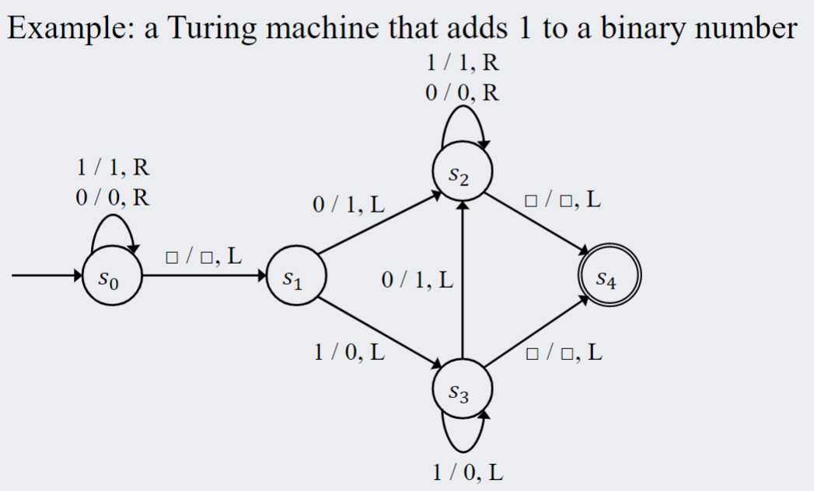

# Regex and DFA

## Goals

1. Determine the components of regular expressions.
2. Write simple regular expressions
3. Trace the operation of a DFA (deterministic finite-state automaton) represented as a diagram) on an input, and indicate whether the DFA accepts or rejects the input.
4. Deduce the language accepted by a simple DFA after working through multiple example inputs.

5. Identify when a Regular Expression can be apply to solve a problem.
6. Explain the difference between a DFA and a NFA.
7. Understand what a Turing machine is and its differences to DFA and NFA.
Identify the operation of a Turing Machine by describing the inputs and outputs in the tape.

## Definitions

## Formal Languages

 words are composed of valid characters, and sentences are composed of valid words. We can extend this in mathematics to develop a system to formalize representation of such symbols.

**Alphabet** $\Sigma$: A finite set of characters

**String over** $\Sigma$: (1) a **finite** juxtaposition of elements (**characters**) of $\Sigma$ or (2) the **null string** $\lambda$

**Length of string over** $\Sigma$: the **number of characters** that make up the string ($\lambda$ has length 0)

**Formal language over** $\Sigma$: a set of **strings** over the **alphabet**

> Example: let $\Sigma = \{ a, b\}$ 
> We define the language $L$ over $\Sigma$ that begins with the letter a, and has a length of at most 3 characters, find L
> 
> $L = \{ a, aa, ab, aaa, aab, aba, abb\}$

### Alphabet
Just like the number set, the alphabet can be constrained to several subtypes. Let $\Sigma$ be an alphabet. For each nonnegative integer $n$, let
- $\Sigma^n =$ the set of all strings over $\Sigma$ that have length $n$
- $\Sigma^+ =$ the set of all strings over $\Sigma$ that have length at least 1 (think natural numbers)
- $\Sigma^* =$ the set of all string over $\Sigma$

Note that $\Sigma^n$ is essentially the **Cartesian product** of $n$ copies of $\Sigma$. The language $\Sigma^*$ is called the **Kleene closure** of $\Sigma$ (Stephen C. Kleene,pronounced CLAY-nee). $\Sigma^+$ is the set of all strings over $\Sigma$ except for $\lambda$ and is called the **positive closure** of $\Sigma$.

> Example: let $\Sigma = \{ a, b\}$, find the value of $\Sigma^0, \Sigma^1, \Sigma^2, \Sigma^1 \cup \Sigma^2$\
> $\Sigma^0 = \{ \lambda \}, \Sigma^1 = \{a, b\}, \Sigma^2 = \{aa, ab, ba, bb\}$\
> $\Sigma^1 \cup \Sigma^2 = \{a, b,aa, ab, ba, bb \}$ the set of string over $\Sigma$ with a length of at least 2.

### Concatenation

**Concatenation** is the process of **joining two strings**. We can extend the concatenation operation on two languages to form a new language. Let $x$ and $y$ be two string over some alphabet $\Sigma$. The concatenation of $x$ and $y$ is the process of writing all the characters of $x$ then $y$ to form $xy$. For any language $L$ and $L'$, we can form the following 3 new languages:
- The **concatenation** of $L$ and $L'$, denoted as $LL'$, is
  $$LL' = \{xy | x \in L \land y \in L' \}$$
- The **union** of $L$ and $L'$ (string is in either languages, $\lor$), denoted as $L \cup L'$, is 
  $$L \cup L' = \{x | x \in L \lor x \in L' \}$$
- The **Kleene Closure** of $L$ (join any string in $L$), denoted as $L^*$, is
  $$L^* = \{x | x \text{ is a concatenation of any finite number of strings in } L \}$$ 
Note: $\lambda \in L^*$ because is a concatenation of 0 strings in $L$.

> Example: bro idk bruh
> sobsobsobs

## Regular Expressions
**Regular expressions** are a way to define languages, a concept introduced by **Kleene**. A regular expression represents some string in the language. We can **recursively** define the set of all regular expression on an alphabet as follows:

Given an alphabet $\Sigma$, the following are **regular expressions** over $\Sigma$:
1. **Base**: $\emptyset$, $\lambda$, and each individual symbol in $\Sigma$ are regular expression over $\Sigma$
2. **Recursion**:  If $r$ and $s$ are regular expressions over $\Sigma$, then the following are also regular expressions over $\Sigma$: 
   $$\text{(i) } (rs) \;\;\;\;\; \text{(ii) } (r|s) \;\;\;\;\; \text{(iii) }(r^*)$$
   where $rs$ is the concatenation of $r$ and $s$; $r^*$ is finite self concatenation(a repeat, or Kleene Closure); $r | s$ is either strings $r$ OR $s$.
3. **Restriction**: nothing is a regular expression of $\Sigma$ except for objects defined in (1) and (2) above.

> Example: a regular expression of $\Sigma = \{a, b, c\}$ can be
> $$a | (b |c) ^* | (ab)^*$$

### Order of Precedence 
To evaluate regular expressions, each operation follows some order of precedence. We can always use brackets to eliminate confusion. The evaluation order of regular expressions are as follows:
1. brackets $( \;)$ are evaluated first
2. Kleene closures $(*)$ are second
3. concatenations are third 
4. or $(\;|\;)$ is last

### Language Defined by a Regular Expression
Now we can work backwards to determine the language that is defined by a regular expression. Similar to the definition of regular expressions, this is also recursively defined. For a regular expression $r$, $L(r)$ is the language defined by $r$.
1. **Base**: $L(\emptyset) = \emptyset, L(\lambda) = {\lambda}, L(a) = {a}$ for every a in $\Sigma$
2. **Recursion**: If $L(r)$ and $L(r')$ are the languages defined by the regular expressions $r$ and $r'$ over $\Sigma$, then 
   $$\text{(i) } L(rr') = L(r)L(r') \;\;\;\; \text{(ii) } L(r|r') = L(r) \cup L(r') \;\;\;\; \text{(iii) } L(r^*) = (L(r))^*$$ 
3. **Restriction**: The language $L$ is completely defined by (1) and (2) above.

In fact, **any** finite language can be defined by a regular expression

### Regular expression to Language (using set notation)
We can use the language rules of regular expressions to write the language defined by a regular expression with set notation

> Example: For $\Sigma = \{a, b\}$, determine the language defined by $(a | b)*$
> $$\begin{align*}
    L((a | b)*) & = L(a | b)*\\
                & = (L(a) \cup L(b))*\\
                & = (\{a\} \cup \{b\})\\
                & = \{a, b\}*\\
                & = \text{the set of all strings of a's and b's}\\
                & = \Sigma^*
\end{align*}$$

### now just have a ton of example that im too lazy to write lol !!!!! just do practice or smth lol!!!

## Practical Applications of Regular Expressions

Regular expression can replace long chains of if else statements in code to search for certain patters. A recursively defined regex pattern can identity pattern in a succinct way. Because of its common use, there are a bunch of shorthands that exist

### 1. Character Class ($[\;]$)
It represents a range of acceptable characters (it is inclusive)
\[[A-C] = (A |B|C)\]
similarly,
\[[0-9] = (0|1|2|3|4|5|6|7|8|9)\]

You can also **combine ranges** (have more than one range),
\[[A-C x-z] = (A|B|C|x|y|z)\]

### 2. Arbitrary Characters ($.$)
An unknown character can be represented with a period ( . ). It is any character in $\Sigma$. For example, if $\Sigma = \{a, b, c\}$
$$a.c = (aac| abc| acc)$$

### 3. Exclusive Character Class ($[^\wedge ...]$)
When placed in front of a character class, it indicates any character in that range cannot occur at that position. It effectively excludes the range. In general, we can say
$$[^\wedge D - Z] = [A -C].$$

### 4. Self Concatenation ($+$)
$r+$ represents the concatenation with itself any finite number of times. Symbolically, 
$$r+ = rr*$$
Notice that $r+$ can never be empty, unlike the Kleene Closure.

### 5. Single Occurrence ($?$)
$r?$ means either 1 or 0 occurrences of r. More formally,
$$r? = (\lambda | r)$$
It limits the expression to be singular.

### 6. Limited Self-Concatenation ($\{n\}$)
For $m,n \in \mathbb{Z}^+$, and $m \le n$,
$$r\{n\} \text{ denotes the concatenation of r with itself exactly n times}$$
and
$$r\{m,n\} \text{ denotes the concatenation of r with itself from between m to n times}$$
Notice that concatenation always starts with the base case, which is $r$ itself.
- {exact}, {min, }, {min, max}

### 7. General character ($.$)
It can be any character in $\Sigma$
- $.at$: $cat$, $bat$, $gat$, $\%at$

### 8. Special characters (\\)
- $\backslash d$, any digit
- $\backslash D$, any non digit
- $\backslash s$, space
- $\backslash S$, non white space
- ...
Back slash can also be used to "escape" special characters such as $.$, $+$, $*$ ...

### 9. Parenthesis ()
These are used to group sets of characters together, they are **DIFFERENT** from square brackets (those represent a range)

### 10. Pipe symbol (|)
This acts as an **XOR**. Let that sink in

 

> examples please
> sadadw
>
> adwawd
> adawd

## Finite-State Automata

The ciructs we discussed in module one are combination circuits: the inputs are directly combined to produce an output. However, there are cases where the next output is dependent on the previous state of the system. Where we want ciruits to behave sequentially.

**Finite-state Automata**: an idealized machine that represents a sequential circuit. The current state of the circuit is dependent on the previous state of the circuit (look at what the value is before).

### Example: a simple vending machine

Suppose we have a vending machine that sells drinks of \$1. If we can only deposit quarters and half-dollars, we can describe the internal operation of the machine using the followin diagram

</img>

Each machine represents the state of the machine -- the amount money that it can hold. The directed arrows point to the next possible state from the current state depending on the action. There is also a final state --  when the machine deposits a drink. The machine also begins with no money inside.

The operation of the machine can also be represented as a "next-state table":

</img>
- the left most column is the possible machine states
- there is a colmn for each possible interaction
  - each cell in those columns point to the next state given the current state

- the final row is the target state.

Although we use vending machines as an example, computers are probably the most important type of DFAs. In essence, a computer just computes the next possible state depending on the input.

## Definition of a Finite-State Automaton

In general a finite-state automaton consists of two parts: a list of the possible state, and a function to compute the next state given the current state and input. This can be formlized below:

A **finite-state automaton** $A$ consists of 5 parts:
1. A finite set $I$, called the **input alphabet**, of input symbols
2. A finite set $S$ of **states** that the automaton can assume
3. A designated state $s_0$ called the **intital state**
4. A designated set of states called the set of **accepting states** (final states that produce wanted result)
5. A **next-state function** $N:S \times I \to S$ that associates a **next-state** to ever pair of "**current-state**" and "**current-input**" (basically a function that determines what next-state is produced depending on current state and input). For $s \in S, m \in I$, the function $N(s,m)$ is the state that $A$ goes to if $s$ is the state and $m$ is the input.

A **DFA (Deterministic Finite-state Automaton)** is formally defined as a **5-tuple** ($\Sigma, S, s_o, F, \delta$):
- $\Sigma$: a finite set of characters (input alphabet)
- $S$: a finite set of states
- $s_o \in S$: the intitial state
- $F \subseteq S$: the set of accepting states
- $\delta: S \times \Sigma \rightarrow S$: the transition function
We can write a regular expression for any DFA!! And we can construct a sequential circuit from a DFA.

**State-transition diagram**: a diagram that shows the stat transitions of an automaton (similar to the vending machine example). Arrows pointing to the next state are labed with the correspond **input** that it represents. $s_0$ is demonstrated with an empty arrow pointing to a state circle. Accepting states are represented with double circles.

**Next-state table**: A table that shows the values of the next-state function for all possible states and inputs. The input is denoted by an empty arrow and the accepting states are denoted with a double circle.

## NFA (non-deterministic finite state automaton)
They are similar to a DFA except:
  - there can be multiple starting states
  - there can be multiple arrows with the same label as a leaving state
  - there can be arrows $\epsilon$ that we can follow without reading the next input character
    - they can transition between states without a character

An NFA will accept a string if at least one sequence of choices leads to an accepting state
- All concurrent paths are traced **simultaneously**!

Every DFA is an NFA but not all NFAs are DFA $DFA \subseteq NFA$

</img>
describes $\epsilon | ab | (aba)+ a$

## Making DFAs for regex
- create states for progress milestones or required features
- split progress paths when encountering "or" (branching)
- break it into parts and try things
- breaking requirements: 1. reset or 2. dead state
- Requirement acheived: progress DFA into next important state
- doesnt break or achieve: self loop until further progress is made

> Example: strings over the alphabet $\Sigma = \{a, b\}$ that start with "aa", contain "bbb" and end with "aaa" or "abb" 
> 
> $aa.*bbb.*(aaa|abb)$

# Turing Machines
A mathematical model that defines an abstract machine
- manipulates symbols on a tape according to a table of rules
- they can construct any logically computable statement

It is a DFA with a tape attached to it
- the tape in infinite
- the head can move one step to the left or right
- it can read/write one position of the tape
- each position can contain one element of the working alphabet
- there is a special symnbol to represent a blank position: $\square$

## Controlling movement
A DFA can control the head and read/write by the following format
- \<read> / \<write>, \<move>

> Examples:
>
> 1/0, R : Reads value 1, replaces it with 0, and moves the head to the right
> 
> $\square$/1, L : Reads a blank value, replaces it with a 1, and moves the head to the left
>
> $\square$/$\square$, R : Reads a blank value, replaces it with a blank value, and moves the head to the right
>
> 0/1, L: Reads value 0, replaces it with a 1, and moves the head to the left

A DFA controls the tape, moving its head and reading/writing 
values
Each arrow in the DFA will have 3 operations
– read the value of the tape
– write a value on the tap
– move the head left or right

A turing machine will stop if it reaches an accepting state (it can also never stop or keep on looping infinitely)

# Sequential Circuits
Output is based on the current inputs AND the previous outputs (they do be looping)
- this acts as memory!! allows for more complex operations
Feedback loops connect the output to the input of earlier devices

"normal circuits" or Combinational circuits:
- the output is generated based only on the current inputs
  
## DFA to Sequential Circuit
DFAs can be translate into sequential circuits
- Enumerate each state as a binary number. Each bit of the binary 
number will be handled by one **flip flop** device
  - 2 states => 1 bit --- $\log_2(\#states)$

- A state table is created to map the transitions from each state
  - the output of these states will be the output of the flipflop after one clock cycle.
  
- Calculate the flip flop inputs (as a combinational circuit proposition) required to make the transitions in the state table

BOom it WILL show up in the LABB

## Worksheet
2.(a) `(..)+`

2.(b) `([1-9]\d*|0)\+([1-9]\d*|0)=([1-9]\d*|0)`

2.(c) `(([0-1][0-9])|(2[0-3])) :[0-5] [0-9]`

2.(d) `([10]*1101[10]*|[10]*1111[10]*)`

> EXAMPLEPMPSLMPMEPMSPMS: idk how to do these ngl
>
> 

