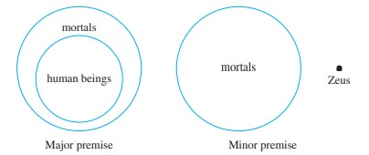
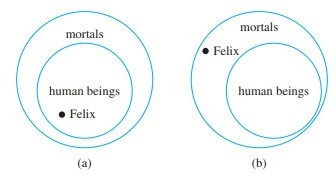

# Direct Proofs

## Goals:

1. **Apply Universal Instantiation**, **Universal Modus Ponens,** and **Universal Modus Tollens** to predicate logic statements that correspond to the rules' premises to infer statements implied by the premises.
2. Identify which strategy use to **prove a statement** based on its **quantifiers**.

3. Devise and attempt multiple different, appropriate **proof strategies**.
4. Practice **direct proofs** and identify common strategies used on those proofs

## Arguments with Quantified Statements

### **Universal Instantiation**
If a property is true for **everything** in a set, then it is true for **any particular** thing in the set.
> A famous example:
> $$\begin{align*}
    &\text{All men are mortal}\\
    &\text{Socrates is a man}\\
    \therefore \;& \text{Socrates is a mortal}
 \end{align*}$$

 ### **Universal** Modulus Ponens
  we can combine universal statements with modulus ponens

$$\begin{align*}
    &\forall x \in S, P(x) \implies Q(x) \\
    &P(a) \text{ for some } a\in S\\
    \therefore \;& Q(a)
\end{align*}$$

### **Universal** Modulus Tollens

SImilarly, we can also combine universal statement with modulus tollens

$$\begin{align*}
    &\forall x \in S, P(x) \implies Q(x) \\
    &\lnot Q(a) \text{ for some } a\in S\\
    \therefore \;& \lnot P(a)
\end{align*}$$

## Validity with Quantified Statements
Recall that validity refers to the validity of form. ie, if all the premises are true, the conclusion must be true. However, if the premises are false, the conclusion does **not** need to be true.

In general, we needs to verify that the conclusion is true if we suppose the premises are true. 

> Example: prove that universal modulus ponens is valid \
> To prove that this form of argument is valid, **suppose the major and minor premises are both true**. [We must show that the conclusion “Q(a)” is also true.] By the minor premise, **P(a) is true for a particular value of a**. By the major premise and universal instantiation, the statement **“If P(a) then Q(a)”** is **true for that particular a**. But by modus ponens, since the statements **“If P(a) then Q(a)” and “P(a)” are both true**, it follows that** Q(a) is true also**. [This is what was to be shown.]

### Proof of Validity using Diagrams
1. use diagrams to represent subsets and supersets
2. determine where the particular value lies relative to those sets
3. determine whether the local of the particular value is indefinite
   - indefinite means the argument is not valid; definite means the argument is valid.

> Example: Consider the following statement
> $$\begin{align*}
    &\text{All humans are mortal}\\
    &\text{Zeus is not mortal}\\
    \therefore \; &\text{Zeus is not a human}
\end{align*}$$
> We can represent the relationship using the following diagram
> 

> everything can only fit together one way, hence the argument is valid \
> (this is an example of modulus tollens)

 
Let's look at an example of Invalid reasoning

 

> Example: Consider the following argument
> $$\begin{align*}
    &\text{All humans are mortal}\\
    &\text{Felix is not mortal}\\
    \therefore \; &\text{Felix is a human being}
\end{align*}$$
> Similarly, we can express the argument using the following diagram:
> 

> Notice that Felix can be in various positions (it is indeterminate) \
> As such, we can say this argument is invalid. (this is an example of the converse fallacy)

## Fallacies
Just like how simple forms of arguments can have fallacies, universal arguments can also have similar fallacies.

### Converse Fallacy
$$\color{red}\begin{align*}
    &\forall x \in S,  P(x) \implies Q(x) \\
    &Q(a) \text{ for } a \in S \\
    \therefore \; & P(x)
\end{align*}$$

### Inverse Fallacy
$$\color{red}\begin{align*}
    &\forall x \in S,  P(x) \implies Q(x) \\
    &\lnot P(a) \text{ for } a \in S \\
    \therefore \; & \lnot Q(x)
\end{align*}$$

## Additional Forms of Argument
we can use the inference rules in [module 4](module_4.md) and convert them into universal form, below is the example of the universal transitivity rule.

### Universal Transitivity

$$\begin{align*}
    &\forall x, P(x) \implies Q(x) \\
    &\forall x, Q(x) \implies R(x) \\
    \therefore \; & \forall x, P(x) \implies R(x)
\end{align*}$$

# Introduction to Direct Proofs

we gotta prove some things with math, well we need to learn the fundamental math first :smile:.

## Even, Odd, Prime, and Composite Numbers

### Even and Odd
An integer is even, if and only if, it is divisible by 2. Likewise, an integer is odd, if and only if, it is not divisible by 2. Mathematically,
$$\begin{align*}
    n \text{ is even } &\iff n = 2k \text{ for some integer } k\\
    n \text{ is odd } &\iff n = 2k + 1 \text{ for some integer } k
\end{align*}$$

### Prime and Composite
An integer is **prime** if, and only if, $n > 1$ and for all positive integers $r$ and $s$, if $n=rs$, then either $r$ or $s$ equals $n$ (the factors of $n$ are only $n$ and $1$). Am integer $n$ is **composite** if, and only if, $n>1$ and $n = rs$ with $1 < r < n$ and $1 < s < n$ (there exists prime factors for $n$). Symbolically, we can say
$$\begin{align*}
    n \text{ is prime} &\iff \forall (r, s) \in \mathbb{Z},\; n = rs \implies (r = 1 \land s = n) \lor (r = n \land s=1)\\
    n \text{ is composite} &\iff \exist (r, s) \in \mathbb{Z} \text{ st. } (n = rs) \land (1 < r < n) \land (1 < s < n)
\end{align*}$$

## Proving Existential Statements

### Constructive Proof of Existence
Just find a case such that the statement is true ngl.

## Disproving Existential Statement
Show that the negation is true, or symbolically, for
$$\exist x \in D, P(x) \implies Q(x)$$
we need to show that the following is true
$$\forall x \in D, P(x) \land \lnot Q(x).$$

## Disproving Universal statements with Counter Example
to disprove a statement of the form
$$\forall x \in D, P(x) \implies Q(x)$$
we just need to show the negation is true:
$$\exist x \in D, P(x) \land \lnot Q(x).$$

## Proving Universal Statements

### Method of Exhaustion 
literally go through every element in the set and show that it works. This is BAD and it wont work most of the time.

## Generalizing from the Generic Particular

To show that *every element* of a set satisfies a certain property, suppose $x$ is a *particular but arbitrarily* chosen element of the set, and show that $x$ satisfies the property.

And symbolically,
- Show that $\forall x \in D$ satisfies $P(x)$
- choose some arbitrary $x \in D$ and demonstrate that is satisfies $P(x)$

## Method of Direct Proof
1. Express the statement to be proved in the form, $\forall x \in D, P(x) \implies Q(x)$
   
2. Begin by *supposing* $x$ is a particular but arbitrarily chosen member of $D$ for which the hypothesis $P(x)$ is true. (Suppose ...)
3. Show that $Q(x)$ is true by using definition, established results, and inference rules.

## Existential Instantiation 

If the existence of a certain kind of object is assumed or has been deduced, then 
it can be given a name, as long as that name is not currently being used to refer to something else in the same discussion.
- it literally means you can give an arbitrary object a name if the name is not already taken

## Proof by cases
To prove the statement of the form "If $A_1$ or $A_2$ or ... or $A_n$ then $C$", prove all of the following
$$\begin{align*}
    A_1 \implies C, \\
    A_2 \implies C, \\
    \vdots \\
    A_n \implies C.
\end{align*}$$
This process shows that $C$ is true regardless of which $A$ happens to be the case

## General Direction for Writing Proofs
1. copy the statement of the theorem which is to be proved
2. clearly mark the beginning with the word "Proof"
3. Make the proof self-contained (it has all the info necessary to prove the statement, explain what the variables mean)
4. Write the proof in complete grammatically correct sentences
5. Keep the reader informed about the status of each statement in the proof (suppose, assume, we must show that ...)
6. Give a reason for each assertion in the proof
7. Include "little words and phrases" that make your logic clear (such that, hence, therefore, it follows ...)
8. Display equations and inequalities

### Common Mistakes (DON'T DO SOBSOBSOBSOBS)
1. arguing from examples, examples do not generalize to the particular
2. using the same letter to mean 2 different things
3. jumping to a conclusion, its not justified!!
4. confusion between "what is known" and "what is to be shown", you can't mix them up !!
5. use "any" when it should be "some"
6. misuse of the word "if", remember if means $\implies$ and that has logic implications. "If" does not equal "Because"
 

# Theorems

## Definition of a Rational Number
> A real number is rational, if, and only if, it can be expressed as a quotient of two integers with a non-zero denominator. A number that isn't rational is called **irrational**. Formally, 
> $$r \text{  is rational } \iff \exists\; a, b \in \mathbb{Z} \text{ such that } r = \frac{a}{b} \land b \not = 0$$

### Integers and Rational Numbers
> Every integer is a rational number.

### Sum of Rational Numbers
> The sum of any two rational numbers is rational

### Zero Product Property
> if neither $a, b = 0$, then $a \times b \not = 0$

### Rational + Irrational 
> the sum of any rational and irrational numnber is irrational
> (this can be proved with contradiction)

## Divisibility
> If $n$ and $d$ are integers, then
> 
> &emsp; $n$ is divisible by $d$ if, and only if, $n$ equals $d$ times some integer and $d \not = 0$. (every integer divides 0)
>
> We can also say:\
> &emsp; $n$ is a multiple of d \
> &emsp; d is a factor of n\
> &emsp; d is a divisor of n\
> &emsp; d divides n\
>
> the notation $d \rvert n$ is read "d divides n". Symbolically, 
> $$d \rvert n \iff \exists k \in \mathbb{Z} \text{ such that } n = dk \land d \lnot = 0$$
> the notation $d \not | n$ is read "d does not divide n"

### Positive Divisor of a Positive Integer
> For all integers $a$ and $b$, if $a$ and $b$ are positive and $a \rvert b$, then $a \le b$

### Divisors of 1
> the only divisors of 1 are 1 and -1

### Definition of indivisibility
> $\forall\; (n, d) \in \mathbb{Z}, \; d \not | n \iff \frac{n}{d} \not \in \mathbb{Z}$

### Transitivity of Divisibility
> $a | b \land b| c \implies a | c$

### Divisibility by a Prime
> Any integer $n > 1$ is divisible by a prime number

## Fundamental Theorem of Arithmetic  
> Given any number $n > 1$, there exists a positive integer $k$, distinct prime number $\{ p_1, p_2, ... , p_k\}$, and positive integers $\{ e_1, e_2, ... , e_k\}$ such that,
> $$n = p_1^{e_1}p_2^{e_2}...p_k^{e_k}$$
> Any prime factorized form of $n$ will be identical to this, except maybe for the order.

### Prime Factorized Form
> Given any number $n > 1$, the **standard factored form** of $n$ is an expression of the form,
> $$n = p_1^{e_1}p_2^{e_2}p_3^{e_3}...p_k^{e_k}$$
> where $k$ is a positive integer, $\{ p_1, p_2, ... , p_k\}$ are prime numbers,  $\{ e_1, e_2, ... , e_k\}$ are positive integers, and $p_1 < p_2 < ... < p_k$.

## The Quotient Remainder Theorem
> Given any integer $n$ and positive integer $d$, there exists unique integers $q$ and $r$ such that
> $$n = dp + r \;\;\; \text{ and } \;\;\; 0 \le  r < d.$$
> In other words, any number can be separated into a number-quotient pair + remainder.

## div and mod
> Given an integer $n$ and a positive integer $d$,
> $$n \text{ div } d = n\;//\;d, \text{ the floor division of n by d}$$
> $$\begin{align*}
    n \text{ mod } d = \;& n \;\% \;d, \text{the first non negative remainder}\\
    &\text{ when n is divided by d}
\end{align*}$$

## Integer Properties
### The parity property
> Any two consecutive integers have opposite parity (odd and even)

### Square of Odd Integer
> The square of any odd integer has the form 8m11 for some integer $m$.

## Absolute Value and the Triangle Inequality

### Definition of the Absolute Value
> the absolute value of $x$, denoted as $|x|$, is defined as
> $$|x| = \begin{cases}
    x \;\;\;\;\;\;\; &\text{ if } x \ge 0 \\
    -x \;\;\;\; &\text{ if } x < 0.
\end{cases}$$

### Absolute value inequality
> For every real number $r$, $-|r| \le r \le |r|$

### Absolute value equality
> For every real number $r$, $|-r| = |r|$.

### Triangle Inequality
> For all real number $x$ and $y$, $|x + y| \le |x| + |y|$.

# Worksheet
> 1 There are perfect squares and perfect cubes larger than 1 that are also Fibonacci number
>
> 1, 1, 2, 3, 5, 8, 13, 21, 34, 55, 89, 144...
>
> 144 is an example of a perfect square (12 * 12)
>
> 8 is an example of a perfect cube (2 * 2 * 2)

> 2 for any ineger, $x(x + 1)$ is even
>
> $x ( x + 1) = x ^ 2 + x$
>
> suppose $x$ is even, $x = 2n$
> $$(2n) ^ 2 + 2n = 4n^2+ 2n = 2 (2n^2+ n)$$
> its divisible by 2, hence even
>
> suppose $x$ is odd, $x = 2n + 1$
> $$(2n + 1) ^ 2 + 2n + 1 = 4n^2 + 6n + 2 = 2(n^2 + 3n + 1)$$
> its divisible by 2, hence even
>
> so its always even

> **Theorem**: for all positive integers $n$, there is an even integer $m$ such that $2n < m < 2n + 3$
>
> Suppose we choose an arbitrary integer $n$, let us choose $m = 2n + 2$
> $$2n < 2n + 2 < 2n + 3$$

> **Theorem**: every positive odd integers is the difference beteween two perfect squares
>
> Suppose we pick an arbitrary number $n$, its consecutive perfect squares is denoted as
> $$n^2 \land (n + 1) ^ 2 = n^2 + 2n + 1$$
> The difference between these two consective squares is
> $$n^2 + 2n + 1 - n^2 = 2n + 1$$
>By defintion, $2n + 1$ is an odd number. And since $n$ is any arbitrary integer, $2n+1$ denotes every odd number.

