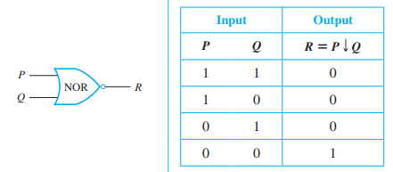

# Common Logic Operators

### AND $\land$
> Conjunction: All need to be true \
> $p \land q$\
> </img>

### OR $\lor$
> Disjunction: At least one needs to be true \
> $p \lor q$ \
> </img>

### NOT $\lnot$
> Inverter: flips values \
> $\lnot p$\
> </img>

### NAND | (Sheffer Stroke)
> Not and: true if none are true\
> $p | q \equiv \lnot(p \land q)$\
> </img>
>
> all gates can be constructed with **only** NAND gates

### NOR $\downarrow$ (Pierce Arrow)
> Not or: false if all are true\
> $p \downarrow q \equiv \lnot(p \lor q)$\
> </img>
>
> all gates can be constructed with **only** NOR gates

### XOR $\oplus$
> Exclusive or: inputs must be different\
> $p \oplus q \equiv (p \lor q) \land \lnot (p \land q)$
>

### Conditional $\implies$
> If P, then Q\
> $P \implies Q \equiv \lnot P \lor Q$\
> Alternative forms:
>  - P only if Q
>  - Contrapositive: $\lnot Q \implies \lnot P$
>  - more probably
> 
> </img>

### Biconditional $\iff$
> P if and only if Q \
> $P \iff Q \equiv (P \implies Q) \land (Q \implies P) \equiv P \oplus Q$ \
> </img>

